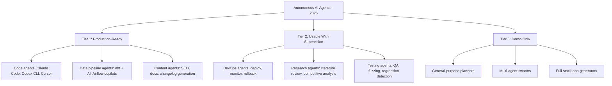

**TL;DR:** Autonomous AI agents in 2026 are real but narrow. They reliably handle well-scoped tasks (code review, data pipelines, content generation) but struggle with open-ended problems. The biggest unsolved challenge isn't capability -- it's trust and quality control.

## What "Autonomous" Actually Means in 2026

Let's be precise about terminology. When we say "autonomous AI agent," we don't mean AGI. We don't mean a system that thinks, plans, and acts across arbitrary domains. We mean:

**An AI system that can complete a multi-step task without human intervention, using tools, making decisions at branch points, and recovering from errors.**

That's it. No consciousness, no general intelligence. Just reliable task completion. And even this modest definition turns out to be surprisingly hard to achieve consistently.

## The Current Landscape

The agent ecosystem in early 2026 has stratified into three tiers:

### Tier 1: Actually in Production

**Code agents** are the clear leaders. Tools like Claude Code, OpenAI's Codex CLI, and Cursor are used daily by thousands of developers. They read codebases, write code, run tests, fix errors, and commit changes. The key breakthrough wasn't just better models -- it was giving agents access to tools (file system, terminal, git, browser) and letting them operate in loops.

Andrej Karpathy's widely discussed "software 3.0" framing -- where code is generated and modified by AI agents that also test and iterate on their own output -- isn't theoretical anymore. It's the default workflow at many startups.

**Data pipeline agents** are the quiet success story. Companies like [Astronomer](https://www.astronomer.io/) and [dbt Labs](https://www.getdbt.com/) have integrated AI agents that can write transformation logic, detect schema drift, and repair broken pipelines. These work well because the problem space is constrained: structured input, deterministic validation, clear success criteria.

**Content generation agents** handle SEO content, documentation updates, changelog generation, and API reference maintenance. The blog you're reading right now is an example. These agents work because the output is verifiable (does the content match the source material?) and the cost of errors is low.

### Tier 2: Works With a Human in the Loop

**DevOps agents** can monitor services, diagnose issues, and propose fixes. Some teams let them auto-rollback deploys when health checks fail. But fully autonomous incident response -- where the agent diagnoses and fixes production issues without human approval -- remains risky. The blast radius of a wrong decision is too high.

**Research agents** can synthesize information from multiple sources, produce structured reports, and identify patterns. They save hours of manual work. But they hallucinate citations, miss nuance, and sometimes confidently present outdated information. A human reviewer is still essential.

**Testing agents** can generate test cases, run regression suites, and identify flaky tests. [OpenAI's self-evolving agent research](https://openai.com/index/self-evolving-agents/) has shown promising results in agents that improve their own test coverage over time. But they still miss edge cases that a human tester catches intuitively.

### Tier 3: Impressive Demos, Limited Production Value

**General-purpose planning agents** -- systems that break down arbitrary goals into sub-tasks and execute them -- remain inconsistent. They work spectacularly on demo problems and fail unpredictably on real ones. The gap between "plan a vacation" (demo) and "migrate our database" (real) is enormous.

**Multi-agent swarms** (multiple specialized agents coordinating on a task) show theoretical promise but introduce coordination overhead that often exceeds the benefit. Getting three agents to agree on a shared plan is, ironically, as hard as getting three humans to do the same.

## The Quality Control Problem

The central challenge of autonomous agents isn't making them capable. It's making them trustworthy.

When a human developer writes code, we have established quality gates: code review, CI pipelines, staging environments, QA teams. When an agent writes code at 3 AM without supervision, those gates don't disappear -- but enforcing them gets complicated.

Current approaches to agent quality control:

1. **Automated verification loops.** The agent writes code, then runs tests, then checks for lint errors, then verifies the build. If any step fails, it retries. This catches ~80% of issues but misses subtle logic errors.

2. **Sandboxing.** Agents operate in isolated environments where they can't cause permanent damage. Good for safety, bad for tasks that need real environment access (like deploy monitoring).

3. **Human approval gates.** The agent proposes changes; a human approves before they take effect. Effective but defeats the "autonomous" part. The current sweet spot is: autonomous for reads and analysis, gated for writes and deployments.

4. **Retrospective auditing.** Let the agent act freely, but log everything and review periodically. Works for low-stakes tasks (content, documentation) but not for high-stakes ones (production infrastructure).

## What's Actually Working vs. What's Still Hype

**Working:**
- Single-agent, tool-using loops on well-defined tasks
- Code generation, review, and modification within existing codebases
- Structured data transformation and validation
- Scheduled automation (monitoring, reporting, alerts)

**Still hype:**
- Fully autonomous software development (agent builds entire features unsupervised)
- Multi-agent collaboration without human coordination
- Self-improving agents that meaningfully increase their own capabilities
- Agents that reliably handle ambiguous, open-ended problems

The gap between these categories is narrowing, but it's still wide enough to matter.

## Predictions for the Next 12 Months

**High confidence:**
- Code agents will become the default way to interact with codebases. Direct file editing will feel like writing assembly -- you can do it, but why would you?
- Agent-to-agent protocols (like Anthropic's MCP and OpenAI's function calling standard) will converge toward interoperability. Tool ecosystems will become portable across agent frameworks.
- Enterprise adoption will accelerate for Tier 1 use cases, with IT departments standardizing on one or two agent platforms.

**Medium confidence:**
- At least one major incident will be caused by an autonomous agent acting without proper guardrails. This will trigger industry-wide discussion about agent safety policies -- similar to how the 2024 CrowdStrike outage changed update deployment practices.
- Tier 2 agents (DevOps, research, testing) will move to Tier 1 as models get better at self-correction and verification.

**Low confidence (but watching closely):**
- Multi-agent systems that actually work in production. The coordination problem may be solved by better protocols rather than better models.
- Agents that maintain long-running context across days or weeks, enabling truly autonomous project management.

## What To Watch

The next 12 months will determine whether autonomous agents become infrastructure (boring, reliable, everywhere) or remain tools (useful, but requiring constant human attention).

The signal to watch isn't capability demos -- those have been impressive for years. Watch for **boring production deployments**: a company mentions in passing that agents handle their nightly deploys, and nobody thinks it's remarkable. That's when autonomous agents have truly arrived.

Until then, the practical advice is the same as it's been: start with well-scoped, low-stakes tasks. Let the agent prove itself on code review before you hand it the deploy keys. Trust is earned in increments, even for machines.
